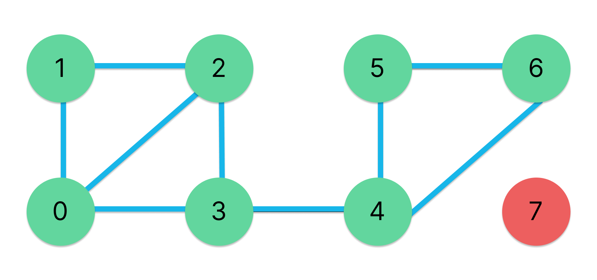

## Graphs
### Classes

A node is a basic data structure which contain data and one or more links to other nodes. Nodes can be used to represent a graph, tree structure or a linked list.

The nodes could contain many values, but in this case it will contain only the name value and an array of neighbor nodes.

```python

class node():
    def __init__(self, name):
        self.name = name
        self.neighbor = []

```


A graph is a data structure that consists of a finite (and possibly mutable) set of vertices or nodes or points, together with a set of unordered pairs of these vertices for an undirected graph or a set of ordered pairs for a directed graph. These pairs are known as edges, arcs, or lines for an undirected graph and as arrows, directed edges, directed arcs, or directed lines for a directed graph.

``` python
class graph():
    def __init__(self):
        self.vertex = {}
```



You can check the code in the [graph.py](./graph.py) file.