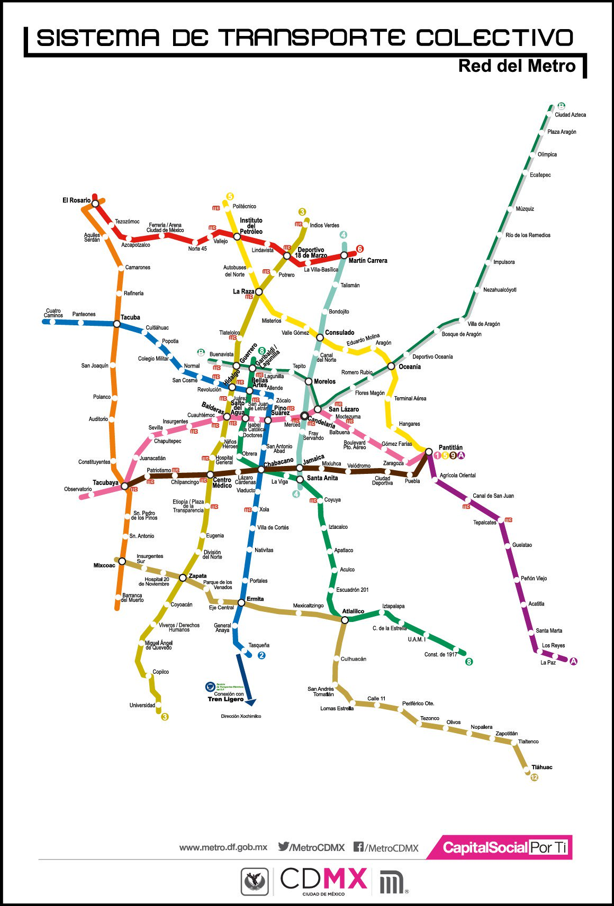

## Graphs II

A graph can be implemented on many real world problems. For example, the social network problem. In this problem, we have a set of users and each user has a list of friends. We can represent this problem as a graph. Each user is a node and the friends are the edges.

Another example is the map problem. In this problem, we have a set of cities and each city has a list of neighbors. We can represent this problem as a graph. Each city is a node and the neighbors are the edges.

In this practice, we will implement a graph to represent the metro map problem. I'm from Mexico City 🇲🇽 and I will use the metro map of Mexico City as an example.



As you can see in the image, the metro map is a graph with nodes and edges. Each node is a station and each edge is a connection between two stations.

``` python
class node:
    # Constructor
    def __init__(self, name):
        self.name = name
        self.neighbors = []
        self.color = None
        self.distance = None
        self.parent = None
```

The node class has the name of the station, a list of neighbors, the color, the distance and the parent.

``` python
class graph:
    # Constructor
    def __init__(self):
        self.vertex = {}
```

The graph class has a dictionary of nodes.


For more details of the graph data structure, you can check the [Practice 6/graph.py](../Practice%206/graph.py) file.
For more details of the code you can check the [metro_graph.py](./metro_graph.py) file.