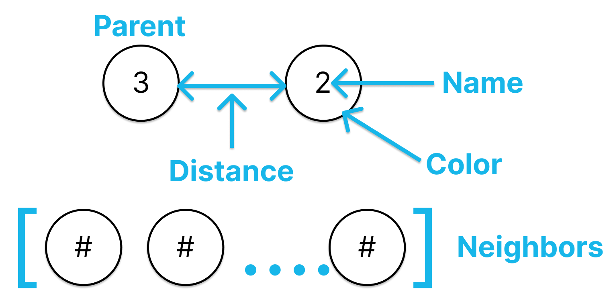

## Graphs II

A graph can be implemented on many real world problems. For example, the **social network problem**. In this problem, we have a set of users and each user has a list of friends. We can represent this problem as a graph. Each user is a node and the friends are the edges.

Another example is the **map problem**. In this problem, we have a set of cities and each city has a list of neighbors. We can represent this problem as a graph. Each city is a node and the neighbors are the edges.

In this practice, we will implement a graph to represent the **metro map problem**. I'm from Mexico City 🌮 and I will use the metro map of Mexico City as an example.


As you can see in the image, the metro map is a graph with nodes and edges. Each node is a station and each edge is a connection between two stations.

### Classes

#### Node

The node class has the name of the station, a list of neighbors, the color, the distance and the parent. The color is used to represent the state of the node. The distance is used to represent the distance from the source node. The parent is used to represent the parent node.

``` python
class node:
    # Constructor
    def __init__(self, name):
        self.name = name
        self.neighbors = []
        self.color = None
        self.distance = None
        self.parent = None
```



The node class has the following methods:
<ul>
    <li><code>add_neighbors</code>: Add a neighbor node to the actual node. </li>
</ul>

#### Graph

The graph class has a dictionary of nodes. The key is the name of the station and the value is the node. This dictionary will be used to store all the nodes of the graph.

``` python
class graph:
    # Constructor
    def __init__(self):
        self.vertex = {}
```

The graph class has the following methods:

<ul>
    <li><code>add_node</code>: Add a node to the graph.</li>
    <li><code>add_edge</code>: Add an edge to the graph.</li>
    <li><code>breadth_first_search</code>: </li>
    <li><code>enqueue</code>: </li>
    <li><code>desqueue</code>: </li>
    <li><code>depth_first_search</code>: </li>
    <li><code>dfs_visit</code>: </li>
    <li><code>find_path_bfs</code>: </li>
    <li><code>find_path_dfs</code>: </li>
    <li><code>print_path</code>: </li>
</ul>


For more details of the graph data structure, you can check the [Practice 6/graph.py](../Practice%206) folder.

For more details of the code you can check the [metro_graph.py](./metro_graph.py) file.