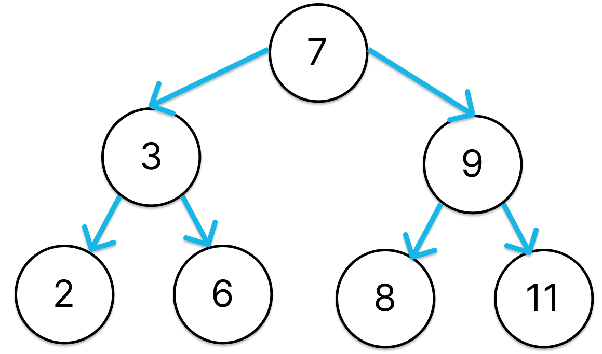

## B Tree


### Classes

#### Node


``` python
class node:
    # Constructor
    def __init__(self, val):
        self.value = val
        self.left = None
        self.right = None
```



#### Graph

The graph class has a dictionary of nodes. The key is the name of the station and the value is the node. This dictionary will be used to store all the nodes of the graph.

``` python
class graph:
    # Constructor
    def __init__(self):
        # Inicializamos el node raiz en None
        self.root = None
```

The graph class has the following methods:

<ul>
    <li><code>add_node</code>: Add a node to the tree.</li>
    <li><code>in_order</code>: .</li>
    <li><code>pre_order</code>: </li>
    <li><code>post_order</code>: </li>
    <li><code>search</code>: </li>
    <li><code>minimum</code>: </li>
    <li><code>maximum</code>: </li>
    <li><code>print_tree</code>: </li>
    <li><code>breadth</code>: </li>
</ul>


For more details of the code you can check the [practice.py](./practice8.py) file.