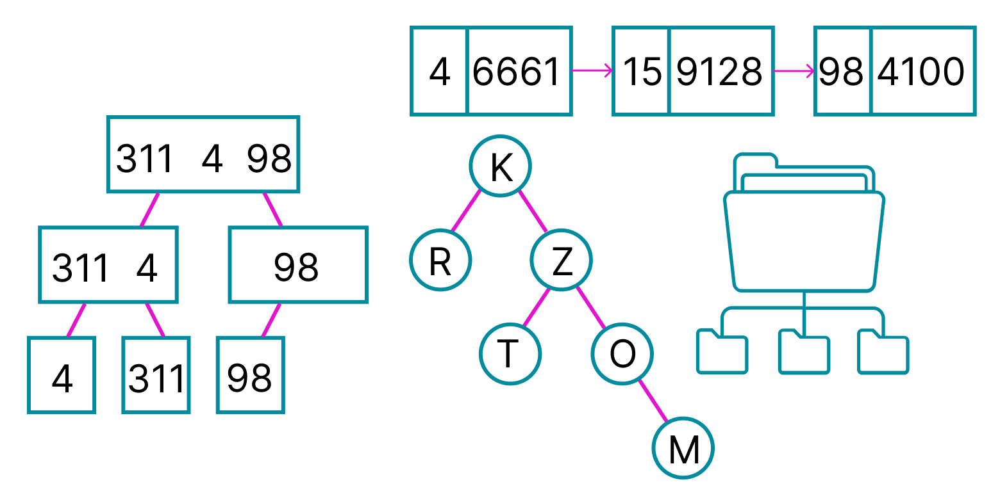

    

## [Practice 0](./Practice%200/) - Fibonacci Sequence

Is the sequence of numbers where each number is the sum of the two preceding ones

## [Practice 1](./Practice%201/) - Sorting Algorithms Part I

## [Practice 2](./Practice%202/) - Sorting Algorithms Part II

## [Practice 3](./Practice%203/) - Sorting Algorithms Part III

## [Practice 4](./Practice%204/) - Searching Algorithms Part I

## [Practice 5](./Practice%205/) - Searching Algorithms Part II

## [Practice 6](./Practice%206/) - Graphs I

A graph is a data structure that consists of a finite (and possibly mutable) set of vertices or nodes

## [Practice 7](./Practice%207/) - Graphs II

The graph class has a dictionary of nodes. The key is the name of the station and the value is the node.

## [Practice 8](./Practice%208/) - Trees I

A full Binary tree is a special type of binary tree in which every parent node/internal node has either two or no children.

## [Practice 9](./Practice%209/) - Trees II

## [Practice 10](./Practice%2010/) - Files

## [Practice 11](./Practice%2011/) - Threads OpenMP

## [Practice 12](./Practice%2012/) - Parallel Programming I

## [Practice 13](./Practice%2013/) - Parallel Programming II

